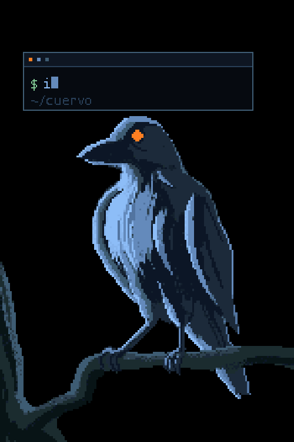
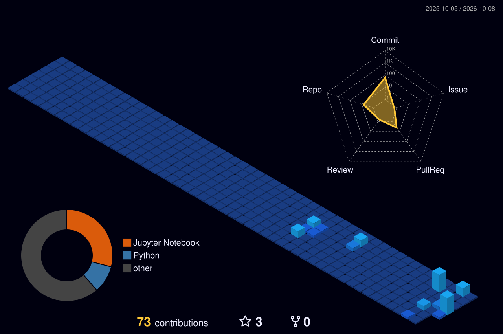

<!-- ─────────────────────────  BANNER  ───────────────────────── -->

  

<!-- ─────────────────────────  TAGLINE  ───────────────────────── -->

  

 

<!-- ─────────────────────────  SOBRE MÍ  ───────────────────────── -->
<table border="0">
  <tr>
    <td valign="top" width="58%">

### About me

I am a physics M.Sc. student working at the point where **scientific computing meets production analytics**.

-  **Research** — Predicting vector meson masses with Variational Quantum Circuits, inside a non-perturbative QCD framework
-  **Work** — SQL analytics on a Yellowbrick / PostgreSQL warehouse: portfolio aging, cohort recovery, collection KPIs
-  **Building toward** — ML Engineering and MLOps: reproducible pipelines, model monitoring, responsible AI
-  **Background** — Civil Engineering before Physics. Two ways of thinking about systems that fail
-  **Fun fact** — Pixel art and retro aesthetics. The crow is mine

 

<!-- ─────────────────────────  CONTACTO  ───────────────────────── -->

  <!-- LinkedIn ya no tiene logo en shields.io: simple-icons lo retiró por
       solicitud de marca. Badge de solo texto, que es lo que sí renderiza. -->
  
  
  

</td>
    <td align="center" valign="middle" width="42%">
      
    </td>
  </tr>
</table>

 

<!-- ─────────────────────────  STACK  ─────────────────────────
     Truco de armonía: todos los badges comparten el MISMO fondo
     (color=161B22, labelColor=0D1117) y solo cambia el logo.
     Si cada badge lleva su color de marca, el bloque se ve ruidoso.
-->

## Tech stack

<b>Core</b>

  
  
  
  
  

<b>Data</b>

  
  
  
  
  
  

<b>Scientific computing</b>

  
  
  
  
  

<b>Currently learning</b>

  
  
  

 

<!-- ─────────────────────────  GRÁFICA 3D  ─────────────────────────
     Generada por el workflow .github/workflows/profile-3d.yml
     NO existe hasta que el Action corra por primera vez.
-->

## Contribution activity

  

 

<!-- ─────────────────────────  ESTADÍSTICAS  ───────────────────────── -->

## Stats

  
  

 

<!-- ─────────────────────────  PROYECTOS  ───────────────────────── -->

## Selected work

| Project | What it is |
| --- | --- |
| [**sql-analytics-practice**](https://github.com/CuervoBlanco05/sql-analytics-practice) | A reproducible PostgreSQL environment for analytical SQL — synthetic loan portfolio, deterministic seed, and queries written to survive the edge cases that break naive joins |
| [**Analytics-Data-Engineering-Portfolio**](https://github.com/CuervoBlanco05/Analytics-Data-Engineering-Portfolio) | Enterprise SQL for data cleaning, window functions, and business logic aggregation connected to executive dashboards |

 

  

