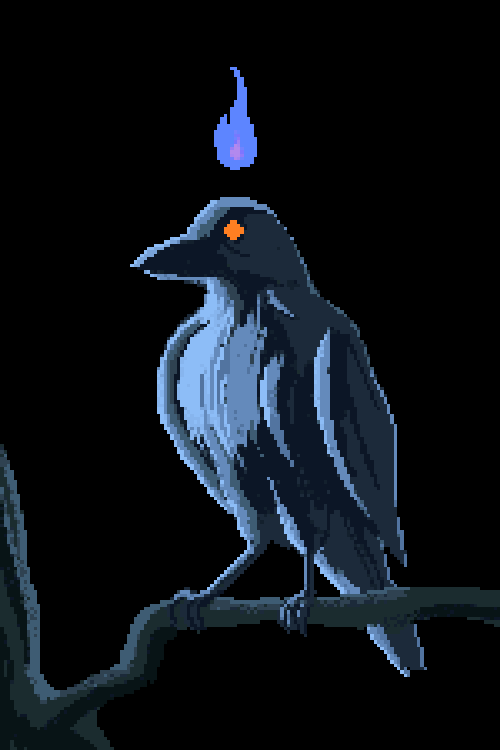

    ## Hi!, I'm Cuervo Blanco (White Crow) 

<table border="0">
  <tr>
    <td valign="top" width="60%">
      
      
    ### About Me
      -  Student / Developer focused on **Backend / Software**
      -  Currently working with **Python, SQL, and Web technologies**
      -  Passionate about learning about scalable architectures and data science
      -  Looking for new challenges and collaborative projects

      ---

    ### Connect with me! 
      -  Ask me about development, coding, or technology
      -  Fun fact: I like pixel art and retro aesthetics
      
    </td>
    <td align="center" valign="middle" width="40%">
      
    </td>
  </tr>
</table>

  <!-- Botón de LinkedIn -->
  
  
  <!-- Botón de Gmail -->
  

<!--
**CuervoBlanco05/CuervoBlanco05** is a ✨ _special_ ✨ repository because its `README.md` (this file) appears on your GitHub profile.

Here are some ideas to get you started:

- 🔭 I’m currently working on ...
- 🌱 I’m currently learning ...
- 👯 I’m looking to collaborate on ...
- 🤔 I’m looking for help with ...
- 💬 Ask me about ...
- 📫 How to reach me: ...
- 😄 Pronouns: ...
- ⚡ Fun fact: ...
-->
